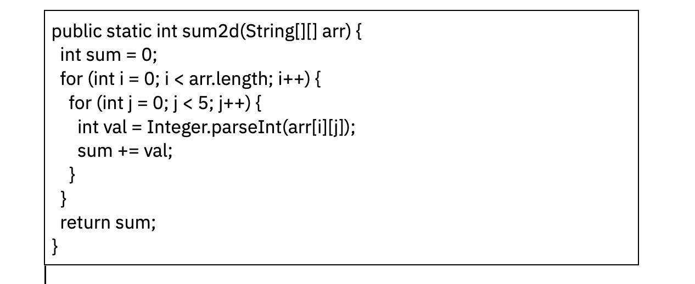

2) ѕосмотрите на код, и подумайте сколько разных типов исключений вы тут сможете получить?

а) можно выйти за границы массива в цикле j - ArrayIndexOutOfBoundsException
б) вход€щий массив состоит из элементов типа String. Ќе получитс€ распарсить в int строки с буквами.